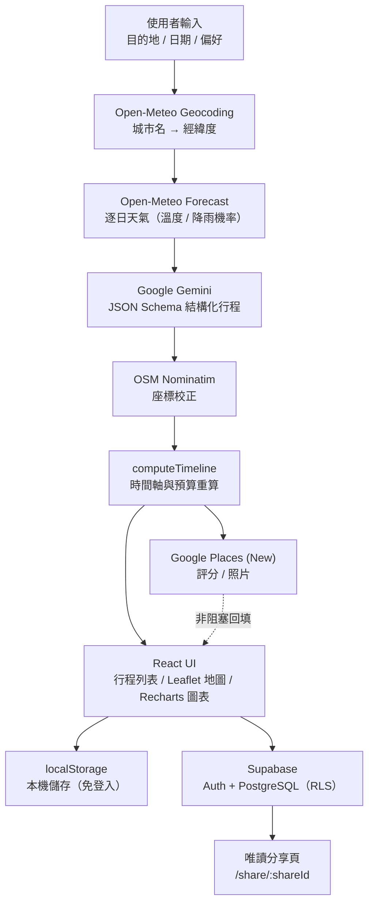

# AI 旅遊行程規劃師

> 依據逐日天氣預報，透過生成式模型產生結構化旅遊行程，並整合地圖、預算圖表與雲端儲存的網頁應用。

English: A web app that fetches a daily weather forecast, feeds it to a generative model to produce a structured itinerary, and renders it with an interactive map, budget charts, and optional cloud storage.


🎬 **Demo 影片**：https://youtu.be/jbbC4vjMaNs

> 本專案目前以**本機執行**為主，未維護對外的線上站台。依「快速開始」設定金鑰後即可在 `http://localhost:5173/` 執行完整功能。

## 目錄

- [系統概述](#系統概述)
- [核心功能](#核心功能)
- [系統架構](#系統架構)
- [降級（fallback）設計](#降級fallback設計)
- [使用技術與開發環境](#使用技術與開發環境)
- [專案結構](#專案結構)
- [快速開始](#快速開始)
- [外部 API 一覽](#外部-api-一覽)
- [已知限制](#已知限制)
- [本機設定與隱私](#本機設定與隱私)

## 系統概述

使用者輸入目的地與日期後，系統先取得該期間的逐日天氣預報，將天氣條件寫入提示，交由 Google Gemini 以 JSON Schema 產生結構化的每日行程；接著用 OpenStreetMap Nominatim 校正模型給的經緯度，再以 Google Places API 非阻塞地補充地點資訊，最後渲染成行程列表、互動地圖與預算圖表。

行程產生後可直接編輯：拖曳排序、鎖定要保留的項目、請模型提供替換候選、整日重新生成；每次變動都會重新計算時間軸與預算。行程可存於瀏覽器本機，登入後亦可同步至 Supabase，並產生唯讀分享連結。

本專案為**網頁設計課程的期末專題**，重點在多個外部服務的整合順序與失效處理，而非行程品質本身。

## 核心功能

| 功能 | 實作方式 | 結果 |
| --- | --- | --- |
| 天氣驅動的行程規劃 | 逐日天氣（含降雨機率）寫入提示 | 降雨機率高的日子優先安排 `indoor` 景點，畫面顯示提示條 |
| 結構化行程生成 | Gemini + `responseSchema`（JSON Schema） | 回應可直接解析為 TypeScript 型別，不需字串剖析 |
| 座標校正 | Nominatim 重新查詢地址，含中文街道地址抽取 | 降低模型給錯座標造成的地圖偏移 |
| 地點資訊補充 | Places API (New) Text Search，濾掉無評論結果 | 補上評分、照片與 Google Maps 連結（需自備金鑰） |
| 行程編輯 | `@dnd-kit` 拖曳、項目鎖定／刪除、模型提供 3 個替換候選 | 每次變動自動重算時間軸與當日／總預算 |
| 交通重新安排 | 確認修改後移除舊交通節點，由模型重新插入 | 依新順序產生合理的交通方式與時間 |
| 地圖視覺化 | react-leaflet，逐日配色、依型別產生 SVG 標記 | 點擊行程卡片，地圖 `flyTo` 對應位置並高亮 |
| 預算分析 | Recharts 圓餅圖 | 交通／住宿／景點／餐飲四類佔比與總預算區間 |
| 儲存與分享 | localStorage + Supabase（Auth / PostgreSQL） | 未登入可存本機；登入後同步雲端並產生唯讀分享連結 |

## 系統架構



行程的完整生命週期收斂在單一 hook（`useTripPlanner`）中，所有編輯操作都經由同一個 `updateDay` 進出，確保時間軸與預算只有一處計算邏輯。

## 降級（fallback）設計

任一外部服務失效時，流程都有可繼續的路徑：

| 情境 | 行為 |
| --- | --- |
| 未設定 Gemini 金鑰 | 改用內建的靜態行程生成器（依降雨機率決定室內／室外骨架） |
| 模型呼叫失敗 | `gemini-2.0-flash` → `gemini-2.5-flash` 依序重試 |
| 中文城市名查無結果 | 查中英對照表轉英文名重新查詢 |
| 餐廳地址查無座標 | 完整地址 → 抽取的街道地址 → 純地址 → 店名＋城市，四段策略重試 |
| 仍無座標 | 借用行程中最近鄰項目的座標並加微小偏移 |
| Places 查無資料或請求失敗 | 該項目不顯示評分照片，行程照常呈現 |
| 交通重新生成失敗 | 降級為保留非交通項目、不插入交通 |
| 未設定 Supabase | 自動隱藏登入與雲端功能，本機功能不受影響 |

## 使用技術與開發環境

| 層級 | 技術 | 用途 |
| --- | --- | --- |
| 前端 | React 19、TypeScript、Vite 8 | 元件、型別與開發／建置工具鏈 |
| 樣式 | 純 CSS（無 UI 框架）、Lucide React | 版面、主題切換與圖示 |
| 互動 | `@dnd-kit/core`、`@dnd-kit/sortable` | 行程拖曳排序（5px 啟動閾值，避免誤觸） |
| 地圖 | react-leaflet、Leaflet、OpenStreetMap 圖磚 | 互動地圖與自訂 SVG 標記 |
| 圖表 | Recharts | 天氣趨勢折線圖、預算圓餅圖 |
| 路由 | react-router-dom v7 | 主頁與 `/share/:shareId` 唯讀分享頁 |
| 生成式模型 | `@google/genai`（Gemini） | 行程生成、替換候選、交通重排、整日重生成 |
| 天氣與地理編碼 | Open-Meteo、OSM Nominatim | 逐日預報、城市與地址座標（皆免金鑰） |
| 地點資料 | Google Places API (New) | 評分、評論數、照片、Maps 連結 |
| 後端服務 | Supabase（Auth + PostgreSQL） | 帳號、雲端行程、Row Level Security |

## 專案結構

```text
.
├─ src/
│  ├─ components/
│  │  ├─ AuthModal.tsx          # 登入 / 註冊 Modal
│  │  ├─ BudgetChart.tsx        # 費用總覽圓餅圖
│  │  ├─ Itinerary.tsx          # 行程列表（拖曳、鎖定、替換）
│  │  ├─ LoadingSkeleton.tsx    # 生成中的骨架畫面
│  │  ├─ SavedTrips.tsx         # 已儲存行程（本機 + 雲端）
│  │  ├─ TripForm.tsx           # 表單輸入
│  │  ├─ TripMap.tsx            # Leaflet 互動地圖
│  │  ├─ WeatherBackground.tsx  # 依天氣切換的背景主題
│  │  ├─ WeatherChart.tsx       # 天氣趨勢圖
│  │  └─ WeatherStrip.tsx       # 逐日天氣卡片
│  ├─ hooks/
│  │  ├─ useAuth.ts             # Supabase 登入狀態
│  │  └─ useTripPlanner.ts      # 行程生命週期與所有編輯操作
│  ├─ pages/
│  │  └─ SharedTrip.tsx         # 唯讀分享頁
│  ├─ services/
│  │  ├─ gemini.ts              # 模型呼叫與 JSON Schema 定義
│  │  ├─ generateItinerary.ts   # 無金鑰時的靜態 fallback 生成器
│  │  ├─ geocode.ts             # Nominatim 座標校正與節流
│  │  ├─ places.ts              # Places API 與結果過濾
│  │  ├─ storage.ts             # localStorage 行程存取
│  │  ├─ supabase.ts            # Supabase client
│  │  ├─ trips.ts               # 雲端行程 CRUD 與分享
│  │  └─ weather.ts             # Open-Meteo 天氣與地理編碼
│  ├─ utils/
│  │  └─ schedule.ts            # 時間軸計算
│  └─ types/index.ts            # 全域型別定義
├─ .env.example                 # 環境變數範本（僅變數名稱）
├─ supabase_schema.sql          # trips 資料表、索引與 RLS Policy
├─ vercel.json                  # SPA 路由 rewrite（自行部署時使用）
└─ INSTALL.md                   # 金鑰申請與資料庫設定的詳細步驟
```

## 快速開始

```bash
git clone https://github.com/Yan-Weichen/weather-trip-planner.git
cd weather-trip-planner
npm install
cp .env.example .env.local   # 填入金鑰後再啟動
npm run dev                  # http://localhost:5173/
```

`.env.local` 需要的變數：

```env
VITE_GEMINI_API_KEY=          # Google Gemini API 金鑰
VITE_SUPABASE_URL=            # Supabase 專案 URL
VITE_SUPABASE_ANON_KEY=       # Supabase anon public key
VITE_GOOGLE_PLACES_API_KEY=   # Google Places API (New) 金鑰
```

四個變數都是選填，缺少時系統會自動降級：

- 未填 Gemini 金鑰 → 改用內建的靜態行程生成器
- 未填 Supabase → 隱藏登入與雲端儲存，其餘功能正常
- 未填 Places 金鑰 → 行程卡片不顯示評分與照片

金鑰申請流程與 Supabase 資料表建立步驟請見 [INSTALL.md](./INSTALL.md)。

## 外部 API 一覽

| API | 用途 | 是否需金鑰 |
| --- | --- | --- |
| Open-Meteo Geocoding / Forecast | 城市座標、未來最多 16 天的逐日天氣 | 否 |
| OSM Nominatim | 地址 → 經緯度（自訂 1,050 ms 節流以符合使用政策） | 否 |
| Google Gemini | 行程生成、替換候選、交通重排 | 是 |
| Google Places API (New) | 評分、評論數、照片、Maps 連結（200 ms 節流） | 是（需啟用 API 並綁定帳單） |
| Supabase | 帳號認證與雲端行程 | 是 |

## 已知限制

- **行程內容是模型輸出的建議草稿，不保證正確。** 模型可能給出不存在的地點或錯誤座標；系統以 Nominatim 校正與「評論數大於 0」的過濾降低明顯錯誤，但未對正確性做驗證。
- **同名城市未做消歧義。** 地理編碼只取回傳的第一筆結果，因此「台南」「高雄」等中文輸入可能匹配到中國的同名城市；建議輸入英文名，或選擇能正確命中的城市。
- **費用與交通時間皆為模型估計值**，非實際報價；交通未串接真實路徑規劃 API。
- **天氣預報上限為未來 16 天**，超出範圍的日期無法查詢。
- **未撰寫自動化測試，也未設定 CI。** 目前以手動操作驗證。
- **前端直接讀取 API 金鑰。** 金鑰經由 `import.meta.env` 注入，會隨前端 bundle 進入瀏覽器端；正確做法是加一層後端代理由伺服器持有金鑰，這是後續要改善的方向。
- 分享連結的 `share_id` 為時間戳加亂數，僅為不易猜測的短 ID，**不是密碼學等級的存取控制**。

## 本機設定與隱私

- `.env.local` 已由 `.gitignore` 忽略（`*.local`），版控中只有不含實際值的 `.env.example`。
- Supabase `trips` 資料表啟用 Row Level Security：使用者只能存取自己的行程；另有一條政策允許任何人讀取 `is_public = true` 的行程，供分享頁使用。
- 申請 Google 金鑰時建議設定 HTTP 參照網址限制，僅允許自己實際使用的網域。
- 未登入時行程只存在瀏覽器的 `localStorage`，不會離開本機。
